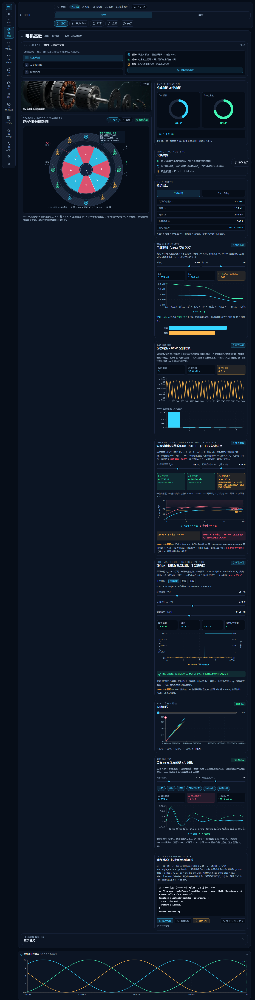
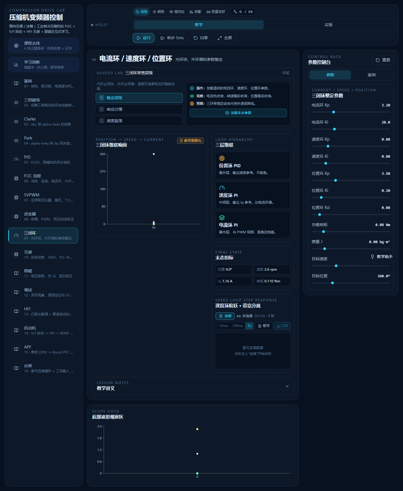

# 电机控制学习客户端（Motor Control Learning Client）

[](https://github.com/Lucas-Xi/motor-control-learning-client/actions/workflows/pr.yml)
[](https://github.com/Lucas-Xi/motor-control-learning-client/actions/workflows/release-audit.yml)
[](https://github.com/Lucas-Xi/motor-control-learning-client/actions/workflows/nightly-desktop.yml)

**[English](README_EN.md)** | 简体中文

面向初中级嵌入式工程师的**交互式电机控制学习客户端**：在浏览器或 Windows 桌面里"拧滑块看波形"地学 BLDC / PMSM / FOC / SVPWM。基础部分讲清坐标变换、PID、SVPWM、逆变器与观测器；进阶部分围绕压缩机变频器真实工况：V/f 与 I/F 启动、HFI 高频注入无感、MTPA、弱磁、共振抑制、齿槽补偿、反液击、APF 前级 PFC 与典型故障排查。

所有算法都是 `src/simulation/math/` 下的纯函数（显式状态输入/输出、统一电角度 rad、三角函数前归一化），可以逐行平移到 STM32 / MATLAB；每个核心函数都带公式来源、单位与工程意义注释。



## 功能总览：16 个教学模块

| # | 模块 | 内容 |
|---|------|------|
| 01 | 电机基础 | 结构、极对数、电/机械角度、绕组连接（星角转换）、温度退磁与热降额 |
| 02 | 三相正弦波与旋转磁场 | 幅值/频率/相位/不平衡/谐波实时驱动三相波形、αβ 矢量与 3D 磁场 |
| 03 | Clarke 变换 | abc → αβ 投影、零序分量、频谱分析 |
| 04 | Park 变换 | αβ → dq 同步旋转坐标，交流量变直流量 |
| 05 | PID 控制 | 阶跃响应 / Bode 图、抗积分饱和对比、**电流环 PI 自整定（模最优法）** |
| 06 | FOC 总体流程 | PWM 中断逐拍拆解：采样→Clarke→Park→PI→反 Park→SVPWM，可点击锁定探针 |
| 07 | SVPWM | 六边形矢量图、扇区判定、T1/T2/T0、过调制；矢量点可直接拖拽 |
| 08 | 三相逆变器 | 桥臂开关、死区畸变与补偿、PWM 瞬态 |
| 09 | 电流环 / 速度环 / 位置环 | 三环整定、伺服定位与运动规划、双质量谐振 Bode、反共振陷波、齿槽前馈与自适应补偿 |
| 10 | 无感 FOC / 观测器 | 反电动势 + SMO + PLL、噪声鲁棒性、观测器切换时机 |
| 11 | 弱磁控制 | 电压/电流极限圆、MTPA、Id-Iq 工作点拖拽 |
| 12 | 故障与调试 | 8 类故障注入：波形现象 → 原因 → 排查步骤 → STM32 对应 |
| 13 | HFI 高频注入 | 凸极比解调、零速无感启动、噪声场景 |
| 14 | 压缩机启动状态机 | V/f → HFI → BEMF → 弱磁全过程、I/F 电流拖动启动、Stribeck 摩擦谷 |
| 15 | APF 前级 PFC | 单相整流 → Boost PFC、开关级仿真、谐波抑制与功率因数校正 |
| 16 | 制冷系统台架 | 蒸气压缩循环、双级压缩、能流桑基图，与 FOC 闭环耦合的整机仿真 |

每个模块配套：中英双语讲义（`ConceptNotes` 折叠区）、引导实验条、实验预设一键加载、挑战题（Quiz）、**动手编程挑战**、桌面/移动双端适配；界面顶栏可一键切换中英文。

## 编程实验室（Code Lab）

16 个模块各配一道编程挑战：在浏览器里实现算法函数（Clarke/Park/PI 抗饱和/SVPWM 扇区/死区电压/陷波系数/MTPA/THD…），即时判题（期望值由参考实现冻结生成）、分级提示，通关后解锁 STM32 C 参考实现（Q15 定点、ISR 内联风格）。学员代码跑在自研教学子集解释器上（无 eval、步数预算可中断），零注入面。通关进度在学习洞察面板汇总。



## 快速开始

```bash
git clone https://github.com/Lucas-Xi/motor-control-learning-client.git
cd motor-control-learning-client
npm install
npm run dev          # http://127.0.0.1:5173
```

### 常用命令

```bash
npm run dev              # Vite 开发服务器
npm run build            # 生产构建（vite build）
npm run typecheck        # tsc -b --noEmit 独立类型检查
npm run test             # vitest 全量单测（86 文件 / 886 用例）
npm run coverage         # v8 覆盖率报告
npm run verify           # 静态守护：246 个必需文件 + 关键 import 校验
npm run e2e              # Playwright 冒烟测试（自动起 dev server）
npm run qa:screenshots   # 16 模块桌面/移动双端截图 → output/screenshots/
npm run release:audit    # 发布审计：verify → build → e2e → screenshots
npm run desktop:pack     # build + Electron 免安装目录打包
npm run docsite          # 生成离线文档站点 docs/site/（可托管 GitHub Pages）
```

### Windows 桌面客户端

```bash
npm run desktop:pack     # 先 build 再产出免安装运行目录
release/win-unpacked/电机控制学习客户端.exe
```

打包细节见 [docs/ELECTRON_AUTOUPDATE.md](docs/ELECTRON_AUTOUPDATE.md)（含自动更新）。

## 架构：六层分离

新增模块严格按"内容 / 参数 / 算法 / 页面 / 路由 / 实验"六层接入，完整流程见 [docs/MODULE_EXTENSION.md](docs/MODULE_EXTENSION.md)：

```
1. 类型    src/simulation/engine/types.ts     ModuleId 联合类型 + 参数 interface
2. 预设    src/simulation/engine/presets.ts   模块元数据 + 默认参数 + 实验预设
3. 状态    src/store/simulationStore.ts       Zustand：state + patch + reset 分支
4. 算法    src/simulation/math/               纯函数，UI 层不写控制算法
5. 内容    src/content/lessons.ts             中文讲义 / 公式 / 术语
6. 页面    src/modules/<module-id>/           专属交互页 + ModuleRenderer 显式路由
```

壳层结构：`AppShell` = Sidebar（导航）+ TopBar（运行控制）+ SimulationPanel（中央教学区）+ ParameterPanel（右侧参数）+ WaveformPanel（底部波形）。全局唯一 store 是 `useSimulationStore`，组件订阅必须用切片选择器避免每帧重渲染。

## 算法清单（src/simulation/math/）

| 文件 | 内容 |
|------|------|
| `transforms.ts` | Clarke / Park / 反 Park / 三相电流生成 |
| `pid.ts` | PI / PID 步进、抗积分饱和、阶跃响应仿真 |
| `pidFrequency.ts` | PI 频域响应（Bode 幅相） |
| `svpwm.ts` | 扇区、T1/T2/T0、占空比、过调制、母线利用率对比 |
| `motorModel.ts` | PMSM dq 模型、电流环、速度环 |
| `inverterModel.ts` | 逆变器平均模型、死区影响 |
| `deadtime.ts` | 死区畸变建模与补偿 |
| `observer.ts` | 反电动势估算 + SMO + PLL |
| `weakField.ts` | 弱磁电压圆、MTPA、转矩估算 |
| `mtpa.ts` | 最大转矩电流比解析解 |
| `focLoop.ts` | FOC 闭环链路仿真 |
| `currentLoopTuning.ts` | 电流环 PI 自整定（模最优）+ 一拍延时离散验证 |
| `motionProfile.ts` | 梯形 / S 曲线运动规划 |
| `mechanicalCompliance.ts` | 双质量弹性传动模型 |
| `twoMassResonance.ts` | 双质量共振 Bode 分析 |
| `resonanceSuppression.ts` | biquad 陷波反共振抑制 |
| `autoNotch.ts` | 扫频辨识 + 自适应陷波对准 |
| `cogging.ts` / `coggingCompensation.ts` / `coggingAdaptive.ts` | 齿槽转矩建模 / 前馈补偿 / 自适应谐波辨识 |
| `ifStartup.ts` | I/F 电流拖动开环启动 + 切闭环判据 |
| `startup.ts` | 压缩机启动状态机时序 |
| `hfi.ts` | 高频注入解调 |
| `smo.ts` | 滑模观测器 |
| `thermalSim.ts` | 一阶热网络（铜损 → 温升 → 参数退化） |
| `apf.ts` / `switchingPfc.ts` | APF 谐波检测 / 开关级 Boost PFC |
| `vaporCycle.ts` | 蒸气压缩制冷循环 |

## 测试与 CI

- **单元测试**：vitest，86 个文件 / 886 个用例，覆盖全部算法模块的收敛性、单调性、单位一致性与 q15 可移植前提。
- **静态守护**：`scripts/verify-project.mjs` 检查 246 个必需文件与关键 import，防止模块回退到泛化 fallback。
- **E2E**：Playwright 冒烟 + 全量可访问性（a11y）扫描。
- **GitHub Actions**（`.github/workflows/`）：
  - `pr.yml` — PR 触发：verify + fault-waves + typecheck + vitest + build
  - `release-audit.yml` — push 到 main：PR CI 全部 + e2e
  - `nightly-desktop.yml` — 每日 UTC 18:00 打包 Windows 客户端
  - `a11y.yml` — 可访问性回归

本机完整预跑 CI：`npm run ci:local`。

## 文档

| 文档 | 内容 |
|------|------|
| [README_EN.md](README_EN.md) | English documentation |
| [docs/MODULE_EXTENSION.md](docs/MODULE_EXTENSION.md) | 新模块接入全流程（六层分离） |
| [docs/ELECTRON_AUTOUPDATE.md](docs/ELECTRON_AUTOUPDATE.md) | Electron 打包与自动更新 |
| [docs/ASSET_PIPELINE.md](docs/ASSET_PIPELINE.md) | AI 视觉素材生成管线 |
| [docs/PRIVACY.md](docs/PRIVACY.md) | 隐私与数据采集说明（本地运行、无遥测） |
| [docs/SECTION_508_COMPLIANCE.md](docs/SECTION_508_COMPLIANCE.md) / [A11Y_AUDIT_R2.md](docs/A11Y_AUDIT_R2.md) | 可访问性审计 |
| [docs/PERFORMANCE_AUDIT_R2.md](docs/PERFORMANCE_AUDIT_R2.md) | 性能审计 |
| [docs/site/](https://lucas-xi.github.io/motor-control-learning-client/) | 在线文档站点（`npm run docsite` 重新生成，内容变更自动部署） |

## STM32 / C 迁移

迁移优先级：`transforms.ts` → `pid.ts` → `svpwm.ts`。ADC 中断只跑快环（采样 → Clarke → Park → PI → 反 Park → SVPWM → 更新 CCR），速度环 / 位置环 / 通信 / 日志放低频任务。关键观测变量：`Ia/Ib/Ic`、`Iα/Iβ`、`Id/Iq`、`Vd/Vq`、`sector`、`dutyA/B/C`、`theta`、`speed`、`fault flags`。角度统一电角度 rad，进入三角函数前归一化；定点化注意各算法测试里的有限性前提（q15 移植安全检查）。

## 许可证

- [Apache License 2.0](LICENSE) — 自学、教学、学术研究、博客/会议分享、团队内部学习免费。
- 商业再分发（二次打包售卖、OEM 嵌入、闭源集成）需要商业授权，见 [LICENSE-COMMERCIAL.md](LICENSE-COMMERCIAL.md)。

## 参与贡献

欢迎 Issue / PR。新增模块请先读 [docs/MODULE_EXTENSION.md](docs/MODULE_EXTENSION.md)，PR 请附 UI 前后对比截图（建议用 `npm run qa:screenshots` 产出）并通过 `npm run ci:local`。
